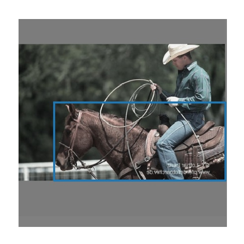

This repo is a [forked version](https://github.com/ultralytics/yolov3) and aim to implement the method proposed in [Omnia faster r-cnn](https://arxiv.org/abs/1812.02611).
This paper introduces an offline method for generating pseudo-label instances in a merged dataset which can contain many missing-label instances. For a brief introduction on merged datasets,
interested readers are referred to [here](https://mahdaneh.github.io/Blogs/Object_Detector.html).

  Instead of faster r-CNN, we used YOLO v3 ([implemented](https://github.com/ultralytics/yolov3)). First, two disjoint datasets are created, using VOC family of datasets, as follows:
  - **VOC 2007**; with following focused categories: 
={*cat, cow, dog, horse, train, sheep*}, **the datatset is called VOC7_A**.
  - **VOC 2012**; ={*car, motorcycle, bicycle, aeroplane, bus, person*}, the dataset is named VOC12_B.

Using function `incld_or_excld_dataset` in `utils/custom_datasets.py`, we load VOC7_A (VOC12_B) from VOC2007 (VOC2012). The categories of interest for VOC7_A are indicated in `voc7-voc12-Exp1/data/voc2007.txt`.

Then, two YOLOs are trained separately on each of the above datasets to be used later for generating pseudo labels for missing label instances from either categories
  or .

More precisely, after merging together VOC7_A and VOC12_B, the resultant dataset can contain missing label instances. For example, in the following annotated image from VOC7_A,
 it contains horse annotated, but no annotation for person as "person" category is not in .
However, after merging VOC7_A and VOC12_B, the person in this image becomes a missing label instance as "person" is an object of interest in .

||
|:--:|
| *Figure 1: A sample from VOC7_A, which contains the annotated instances from {*cat, cow, dog, horse, train, sheep*}. While the "Person" instance is not an object of interest in VOC7_A, it becomes a missing-label instance after merging VOC7_A and VOC12_B.* |

> In conclusion, using YOLO trained on VOC12_B, the authors proposed to generate pseudo label for the possible missing-label instances from   in VOC7_A. Simialrly, using YOLO trained on VOC7_A, the missing label instance that exist in VOC7_B can be generated.

As main point of start, in order to train a YOLO model, test it,  or generate pseudo_label for missing label instance, `offline_ODs.py` should be used.

## required packages:
- matplotlib
- opencv
- tqdm
- torchvision
- pillow
- torch

## Reference
 Rame, E. Garreau, H. Ben-Younes, and C. Ollion, “Omnia faster r-cnn: Detection in the wild through dataset merging and soft distil-lation,”arXiv preprint arXiv:1812.02611, 2018.
